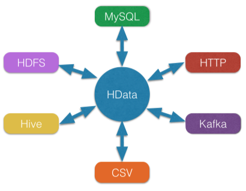
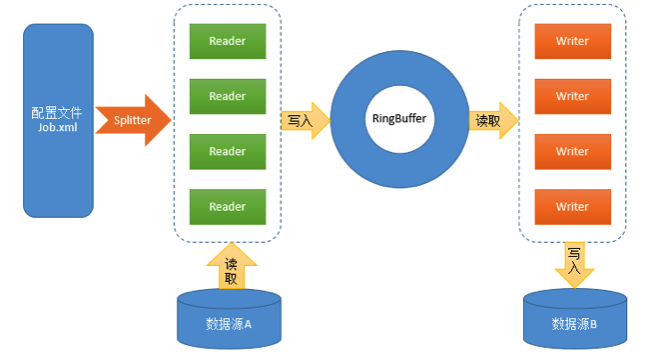

## HData

HData是一个异构的ETL数据导入/导出工具，致力于使用一个工具解决不同数据源（JDBC、Hive、HDFS、HBase、MongoDB、FTP、Http、CSV、Excel、Kafka等）之间数据交换的问题。HData在设计上同时参考了开源的Sqoop、DataX，却与之有不同的实现。HData采用“框架+插件”的结构，具有较好的扩展性，框架相当于数据缓冲区，插件则为访问不同的数据源提供实现。




#### 【HData特性】

1、异构数据源之间高速数据传输；

2、跨平台独立运行；

3、数据传输过程全内存操作，不读写磁盘；

4、插件式扩展。





#### 【HData设计】

- 配置文件：XML格式，配置Reader、Writer的参数（如：并行度、数据库连接地址、账号、密码等）；


- Reader：数据读取模块，负责从数据源读取数据并写入RingBuffer；


- Splitter：根据配置文件中Reader的并行度构造相应数据的ReaderConfig对象供Reader使用，以实现数据的并行读取；


- RingBugffer：来自Disruptor的高性能环形数据缓冲区，基于事件监听模式的异步实现，采用无锁方式针对CPU缓存优化，在此用于Reader和Writer的数据交换；


- Writer：数据写入模块，负责从RingBuffer中读取数据并写入目标数据源。

HData框架通过配置读取解析、RingBugffer 缓冲区、线程池封装等技术，统一处理了数据传输中的基本问题，并提供Reader、Splitter、Writer插件接口，基于此可以方便地开发出各种插件，以满足各种数据源访问的需求。


#### 【编译&运行】

* 编译

执行 *./bin/package-hdata.sh* 命令，执行成功后将会生成压缩包 *./build/hdata.tar.gz* ，然后解压即可。

* 运行

##### 1、命令行配置方式

./bin/hdata --reader READER_NAME -Rk1=v1 -Rk2=v2 --writer WRITER_NAME -Wk1=v1 -Wk2=v2

>READER_NAME、WRITER_NAME分别为读/写插件的名称，例如：jdbc、hive
Reader插件的参数配置以-R为前缀，Writer插件的参数配置以-W为前缀。

例子（Mysql -> Hive）：

>./bin/hdata --reader jdbc -Rurl="jdbc:mysql://127.0.0.1:3306/testdb" -Rdriver="com.mysql.jdbc.Driver" -Rtable="testtable" -Rusername="username" -Rpassword="password" -Rparallelism=3 --writer hive -Wmetastore.uris="thrift://127.0.0.1:9083" -Whdfs.conf.path="/path/to/hdfs-site.xml" -Wdatabase="default" -Wtable="testtable" -Whadoop.user="hadoop" -Wparallelism=2

##### 2、XML配置方式

job.xml

```xml
<?xml version="1.0" encoding="UTF-8"?>

<job id="job_example">
    <reader name="jdbc">
		<url>jdbc:mysql://127.0.0.1:3306/testdb</url>
		<driver>com.mysql.jdbc.Driver</driver>
		<table>testtable</table>
		<username>username</username>
		<password>password</password>
		<parallelism>3</parallelism>
	</reader>

	<writer name="hive">
		<metastore.uris>thrift://127.0.0.1:9083</metastore.uris>
		<hdfs.conf.path>/path/to/hdfs-site.xml</hdfs.conf.path>
		<database>default</database>
		<table>testtable</table>
		<hadoop.user>hadoop</hadoop.user>
		<parallelism>2</parallelism>
	</writer>
</job>
```

运行命令：

> ./bin/hdata -f /path/to/job.xml


#### 【配置参数】

**其中，参数parallelism为读/写并行度，所有插件均有该参数，默认为1。**

**设置合理的parallelism参数可提高性能。**

#### 【Reader配置参数】

* console

无配置参数，一般仅用于测试

* jdbc

参数        | 是否必选   | 描述                    |
-----------| ----- | ---------------------------------------- |
driver|是|JDBC驱动类名，如：com.mysql.jdbc.Driver|
url|是|JDBC连接地址，如: jdbc:mysql://localhost:3306/db|
username|是|数据库用户名|
password|是|数据库密码|
table|是|表名（包含数据库名或schema名），如：db.table，也支持分表，例如:table[001-100]|
columns|否|字段名，多个字段用逗号“,”分隔。不填则选取所有字段。|
exclude.columns|否|排除的字段名，多个字段用逗号“,”分隔|
where|否|查询条件，如：day=’20140418’|
sql|否|自定义查询SQL|
split.by|否|并行读取切分的字段|
max.size.per.fetch|否|单次执行SQL获取的最多记录数|
null.string|否|替换当字符串类型的字段值为NULL时的值|
null.non.string|否|替换当非字符串类型的字段值为NULL时的值|
field.wrap.replace.string|否|若字符串字段中存在换行符时需要替换的值|
number.format|否|小数类型字段的输出格式|

* hive

参数        | 是否必选   | 描述                    |
-----------| ----- | ---------------------------------------- |
metastore.uris|是|Hive Metastore连接地址，如：thrift://localhost:9083|
database|否|数据库名，默认：default|
table|是|表名|
partitions|否|分区，例如: visit_date='2016-07-07'|
hadoop.user|否|具有HDFS读权限的用户名|
hdfs.conf.path|否|hdfs-site.xml配置文件路径|
select.columns|否|选择读取的字段|
convert.null|否|设置值为NULL时对应的字符串，默认："NULL"|


* hdfs

参数        | 是否必选   | 描述                    |
-----------| ----- | ---------------------------------------- |
dir|是|HDFS目录路径，如：hdfs://192.168.1.1:8020/user/dir1|
filename|是|文件名，支持正则表达式|
schema|否|输出的字段定义|
fields.separator|否|字段分隔符，默认：\0001|
encoding|否|文件编码，默认：UTF-8|
hadoop.user|否|具有HDFS读权限的用户名|
hdfs.conf.path|否|hdfs-site.xml配置文件路径|

* hbase

参数        | 是否必选   | 描述                    |
-----------| ----- | ---------------------------------------- |
zookeeper.quorum|是|Zookeeper连接地址，如：192.168.1.16,192.168.1.17|
zookeeper.client.port|否|Zookeeper客户端端口，默认：2181|
table|是|表名|
start.rowkey|否|Rowkey起始值|
end.rowkey|否|Rowkey结束值|
columns|是|读取的列，如：:rowkey,cf:start_ip,cf:end_ip|
schema|是|输出的字段定义，如：id,start_ip,end_ip|
zookeeper.znode.parent|否|hbase使用的Zookeeper根节点|

* http

参数        | 是否必选   | 描述                    |
-----------| ----- | ---------------------------------------- |
url|是|URL链接|
encoding|否|编码，默认UTF-8|

* kafka

参数        | 是否必选   | 描述                    |
-----------| ----- | ---------------------------------------- |
topic|是|需要消费的topic|
group.id|是|consumer组id|
zookeeper.connect|是|Zookeeper连接地址，如：198.168.12.34:2181|
consumer.stream.count|否|数据消费流的数量，默认为1|
encoding|否|编码，默认UTF-8|
max.fetch.size|否|最大fetch数，默认：100000|
max.wait.second|否|最大等待时间（单位：秒），默认：300|
partition.id|否|默认：0|
start.offset|否|需要消费的起始offset|
fields.separator|否|字段分隔符，默认\t|
schema|否|输出的字段定义，如：id,start_ip,end_ip|

* ftp

参数        | 是否必选   | 描述                    |
-----------| ----- | ---------------------------------------- |
host|是|FTP连接地址，如：192.168.1.1|
port|否|FTP端口，默认：21|
username|是|用户名|
password|是|密码|
dir|是|FTP目录，如：/input/dir|
filename|是|文件名，支持正则表达式|
recursive|否|是否递归搜索文件，默认：false|
encoding|否|文件编码，默认：UTF-8|
fields.separator|否|字段分隔符，默认：\t|
schema|否|输出的字段定义|
fields.count.filter|否|符合的字段数，不符合则过滤记录|

* mongodb

参数        | 是否必选   | 描述                    |
-----------| ----- | ---------------------------------------- |
uri|是|MongoDB连接地址，如：mongodb://localhost/test.ip|
query|否|查询语句，如：{"city":"XXX"}|

* csv

参数        | 是否必选   | 描述                    |
-----------| ----- | ---------------------------------------- |
path|是|本地文件路径|
start.row|否|数据起始行数，默认：1|
encoding|否|编码，默认：UTF-8|

* excel

参数        | 是否必选   | 描述                    |
-----------| ----- | ---------------------------------------- |
path|是|文件路径|
include.column.names|否|是否包含列名，默认：false|


#### 【Writer配置参数】

* jdbc

参数        | 是否必选   | 描述                    |
-----------| ----- | ---------------------------------------- |
driver|是|JDBC驱动类名，如：com.mysql.jdbc.Driver|
url|是|JDBC连接地址，如: jdbc:mysql://localhost:3306/db|
username|是|数据库用户名|
password|是|数据库密码|
table|是|表名（包含数据库名或schema名），如：db.table|
batch.insert.size|否|批量插入的记录数，默认值：10000|
schema|否|字段名配置，一般用于writer和reader的字段名不一致时|

* hive

参数        | 是否必选   | 描述                    |
-----------| ----- | ---------------------------------------- |
metastore.uris|是|Hive Metastore连接地址，如：thrift://localhost:9083|
database|否|数据库名，默认：default|
table|是|表名|
partitions|否|分区条件，如：day='20140418'|
hadoop.user|否|具有HDFS写权限的用户名|
hdfs.conf.path|否|hdfs-site.xml配置文件路径|

* hdfs

参数        | 是否必选   | 描述                    |
-----------| ----- | ---------------------------------------- |
path|是|HDFS文件路径，如：hdfs://192.168.1.1:8020/user/1.txt|
fields.separator|否|字段分隔符，默认：\t|
line.separator|否|行分隔符，默认：\n|
encoding|否|文件编码，默认：UTF-8|
compress.codec|否|压缩编码，如：org.apache.hadoop.io.compress.GzipCodec|
hadoop.user|否|具有HDFS写权限的用户名|
max.file.size.mb|否|单个文件最大大小限制（单位：MB）|
partition.date.index|否|日期字段索引值，起始值为0|
partition.date.format|否|日期格式，如：yyyy-MM-dd|
hdfs.conf.path|否|hdfs-site.xml配置文件路径|

* hbase

参数        | 是否必选   | 描述                    |
-----------| ----- | ---------------------------------------- |
zookeeper.quorum|是|Zookeeper连接地址，如：192.168.1.16,192.168.1.17|
zookeeper.client.port|否|Zookeeper客户端端口，默认：2181|
table|是|表名|
columns|是|列名，如：:rowkey,cf:start_ip|
batch.insert.size|否|批量插入的记录数，默认值：10000|
zookeeper.znode.parent|否|hbase使用的Zookeeper根节点|

* kafka

参数        | 是否必选   | 描述                    |
-----------| ----- | ---------------------------------------- |
topic|是|需要消费的topic|
fields.separator|否|字段分隔符，默认\t|

* ftp

参数        | 是否必选   | 描述                    |
-----------| ----- | ---------------------------------------- |
host|是|FTP连接地址，如：192.168.1.1|
port|否|FTP端口，默认：21|
username|是|用户名|
password|是|密码|
path|是|FTP保存目录|
encoding|否|文件编码，默认：UTF-8|
fields.separator|否|字段分隔符，默认：\t|
line.separator|否|行分隔符，默认\n|
gzip.compress|否|是否启用gzip压缩，默认：false|

* mongodb

参数        | 是否必选   | 描述                    |
-----------| ----- | ---------------------------------------- |
uri|是|MongoDB连接地址，如：mongodb://localhost/test.ip|
query|否|查询语句，如：{"city":"XXX"}|

* csv

参数        | 是否必选   | 描述                    |
-----------| ----- | ---------------------------------------- |
path|是|本地文件路径|
separator|否|字段分隔符，默认逗号","|
encoding|否|编码，默认：UTF-8|

* excel

参数        | 是否必选   | 描述                    |
-----------| ----- | ---------------------------------------- |
path|是|文件路径|
include.column.names|否|是否包含列名，默认：false|

* console

无配置参数，一般仅用于测试


#### 【Reader的并行度切分依据】

Reader     | 并行度切分依据   |
-----------| ----- |
jdbc|数值型主键（或配置指定列）的大小范围。默认会根据查询条件查找max(id)和min(id)，然后根据id的区间范围均分，每个线程负责读取其中一份区间的数据|
hive|文件数量|
hbase|rowkey区间|
hdfs|文件数量|
mongodb|_id区间|
ftp|文件数量|
http|http接口中的offset参数|
kafka|无。使用High-Level Consumer API|
csv|文件数量|
excel|无|